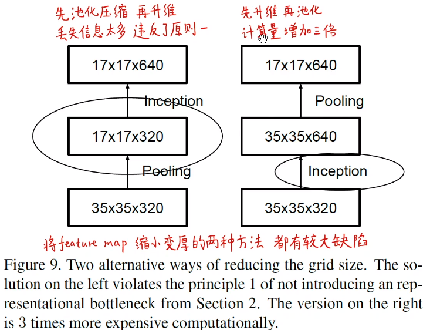
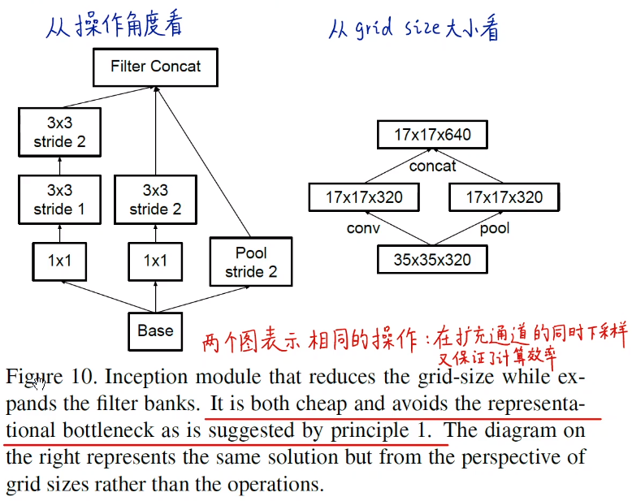

- [bilibili-子豪兄](https://www.bilibili.com/video/BV1r7411X7LC?p=4)
- [Inception-v3 network architecture](https://miro.medium.com/max/1400/1*gqKM5V-uo2sMFFPDS84yJw.png)
- [Inception-v1-to-v4-progress](https://www.itread01.com/content/1544969366.html)
- [Medium-Review: Inception-v3 — 1st Runner Up (Image Classification) in ILSVRC 2015](https://medium.com/@sh.tsang/review-inception-v3-1st-runner-up-image-classification-in-ilsvrc-2015-17915421f77c)
- [zhihu-Inception V1,V2,V3,V4 模型总结](https://zhuanlan.zhihu.com/p/52802896)

### Inception技术演进
- Googlenet-V1
- BN-Inception
- V2~V3
- V4, Inception-ResNet
- Xception, 深度可分离卷积

### 计算机视觉的基础任务
- 分类
- 检测
- 分割

### Inception V3
#### Main idea
- 重新思考Inception结构，减少param，提高模型的表达能力，提高模型运行效率
- 重新思考辅助分类器的作用
- 卷积分解
- 正则化，辅助分类器和label smoothing

#### op对比
- AlexNet : 60 million parameters
- VGGNet : 3× more parameters than AlexNet, 16/19 layers
- GoogLeNet / Inception-v1 : 7 million parameters, 22 layers
- Inception V3 : 25 million parameters, 42 layers

#### 提出通用网络设计原则（假设性提出）
- (1) 慎用bottleneck特征，特别在浅层网络，不要过度压缩网络
- (2) 高维度特征在网络内部更容易处理。特征越多，收敛越快。
- (3) 在3×3和5×5大卷积之前可用1×1小卷积先将维，信息不会损失。因为邻近特征的强相关性，使得用1×1卷积将维时，信息损失比较少。
- (4) 均衡网络的宽度和深度，两者同时提升，即可提高性能，也可以提高计算效率。

#### 具体操作
- 分解大卷积核的卷积，inception模块是全卷积网络，减少kernel filters的参数量
- (1) 分解大卷积
  - 5×5卷积可拆解成2个3×3卷积，参数量减少了28%
  - 7×7卷积可拆解成3个3×3卷积
  - Why? 灵魂二问，1 分解卷积是否影响模型表达能力， 2 是否需要保留第一层的非线性激活函数
  - Ans, 1 因为邻近特征存在强相关性，2 实验证明，保留非线性激活函数效果更好，增强了可学习空间
- (2) 空间可分离卷积
  - 将3×3卷积分解为1×3和3×1两个不对称卷积
  - 目的是进一步减少参数
- (3) 拓展滤波器组
  - 增加特征维度
  - 增加模型的宽度
  - 在模型的后半部分使用
- (4) 辅助分类器的作用
  - inception v1中提出辅助分类器能加速模型收敛，改善梯度消失，起到正则化的作用，然而实验验证并没有
  - 但是在辅助分类器中加上BN或者dropout层，主分类头性能会更好，辅助分类器也能起到正则化的作用
  - 最后在中间保留了一个辅助分类器
- (5) 更高效的下采样方法
  - 下采样方法用到的是池化(Pooling)，往往在池化之前应先升维，这样能保留更多信息
  - 之前提出的下采样方法有二，
    - 一是用步长为1的卷积升维再池化，这样做计算量很大
    - 二是直接用步长为2的卷积做池化再升维，这样做信息丢失多，违背准则1
    - 
  - 提出新的下采样方法，并行
    - 即用pooling下采样，也用卷积下采样，最后concate在一起，也是inception并行模块结构
    - 
