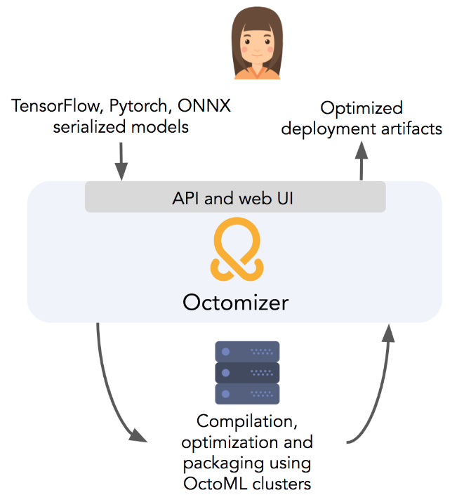
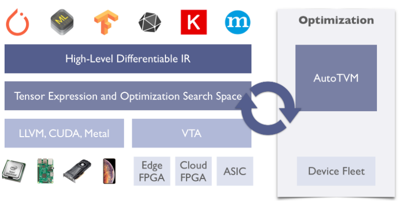

## US
- (1). [latent-AI](https://latentai.com/)
  - Base: CA & NYC
  - 核心产品：Latent AI Efficient Inference Platform (LEIP)
    - LEIP is a modular, fully-integrated workflow designed to train, quantize and deploy edge AI neural networks. 
  - 核心技术：神经网络压缩，量化优化，模型编译
  - What they do: We take the hard work out of AI processing on the edge.  Latent AI’s LEIP platform brings AI to the edge by optimizing for compute, energy and memory without requiring changes to existing AI/ML infrastructure and frameworks.
  - 边缘计算加速的平台，加速训练好的tensorflow模型
  
- (2). [weights&biases](https://www.wandb.com/)
  - Base: CA
  - 核心产品：模型训练过程的监视和可视化平台。
    - wandb python package, sweeps platform
  - 核心技术：超参数tuning，可拓展的，定制的平台
  - What they do: Weights & Biases is an experiment tracking platform for deep learning. Our tools make collaborative deep learning easy for teams by organizing experiments and notes in a shared workspace, tracking all the code and hyperparameters, and visualizing output metrics.
  
- (3). [OctoML](https://octoml.ai/)
  - Base: Seattle, Washington
  - CTO: [陈天奇大佬](https://tqchen.com/)
  - 核心产品：部署机器学习模型到任何设备上，更快更安全。
    - The Octomizer， 一键优化模型，加速部署在不同平台上。
    - 
    - refer, [Medium-OctoML ≔ Easier machine learning](https://medium.com/octoml/octoml-easier-machine-learning-67e217fffa20)
  - 核心技术，TVM
    - [Apache TVM](https://tvm.apache.org/about)
    - Apache(incubating) TVM is an open deep learning compiler stack for CPUs, GPUs, and specialized accelerators. It aims to close the gap between the productivity-focused deep learning frameworks, and the performance- or efficiency-oriented hardware backends. TVM provides the following main features:
      - Compilation of deep learning models in Keras, MXNet, PyTorch, Tensorflow, CoreML, DarkNet into minimum deployable modules on diverse hardware backends.
      - Infrastructure to automatic generate and optimize tensor operators on more backend with better performance.
      - 
