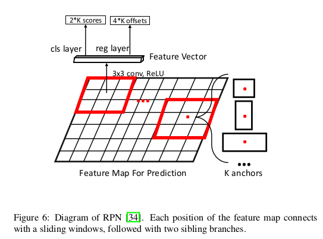

### Two papers of history of object detection

#### [Recent Advances in Deep Learning for Object Detection-Agu/19](https://arxiv.org/pdf/1908.03673v1.pdf)

- 
---
- 
---
- 
- 
- 
- 
- 

#### [Object_Detection_in_20_Years_A_Survey-May/19](https://www.researchgate.net/profile/Zhengxia_Zou/publication/333077580_Object_Detection_in_20_Years_A_Survey/links/5cfe753d299bf13a384c5dd1/Object-Detection-in-20-Years-A-Survey.pdf?_sg%5B0%5D=furij2pvoZYfXs58HweC1pPDJ4WA8eI3zkd70-ueN7m_keBL2F_yVUXRhnWIXmuJ1AGvv_w3OI941tTzpEa2Zw._mGvL0cvZ-IPITDKA8l37TwXosK7REc8r1StCmPJCAhkX1OK6xl4XgqtXSrzatZt33gq-_y0Mym5r8pzN_-vIg&_sg%5B1%5D=qZSAkgkfDdYotIvf_KW3AmOgKNFZsdd0E8t88i2PN9JVQoQ01Ph1CZfsD6Td2V4NQAI4xQkossJvvhxERPxu26RXL9KF2l0h7CazF-w2B4_I._mGvL0cvZ-IPITDKA8l37TwXosK7REc8r1StCmPJCAhkX1OK6xl4XgqtXSrzatZt33gq-_y0Mym5r8pzN_-vIg&_iepl=)
